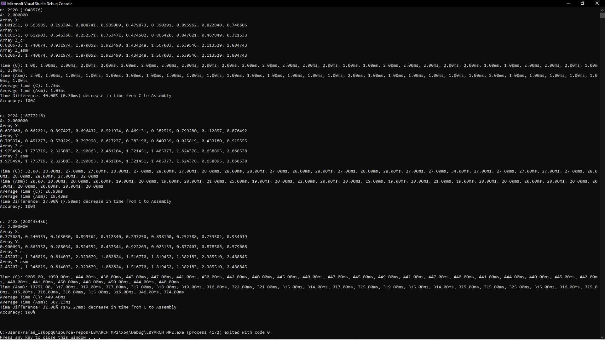
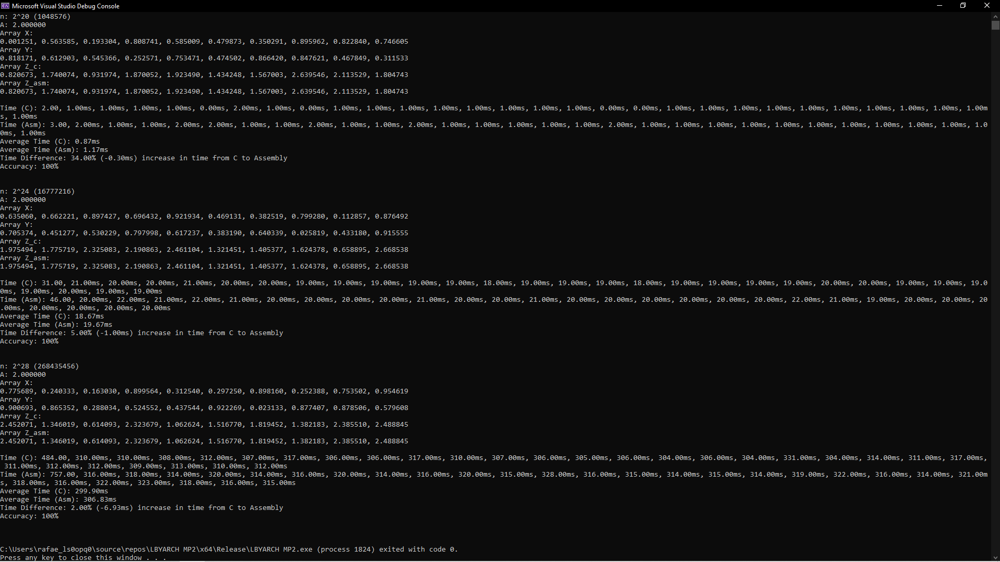

Comparative execution time of kernels
Short analysis of performance of kernels
Screenshots of program output w/ correctness check (C)
Screenshots of program output w/ correctness check (x86-64)

# x86-to-C Interface Programming Project
This project was made to compare the performance of two kernel versions, implemented in C and x86-64 Assembly. The performance is measured in terms of execution time, and are executed in both Debug and Release Configurations of Visual Studio 2022.
### Group Members:
Chan, Dane Marcus  
Gamboa, Rafael Tadeo  

## Specifications
The project comprises of 2 kernel versions (C and x86-64), and both are to simulate the DAXPY (AX + Y) function. 

**Input:**
- Scalar variable **_n_** (integer) contains the length of the vectors X, Y, and Z
  - For the analysis, n will have possible values of **2^20, 2^24,** and **2^28**
- Scalar variable **_A_** is a double-precision float value (set to **2.00** for the analysis)
- Vectors **_X, Y,_** and **_Z_** are double-precision floats of length n
  - For the analysis, **_X and Y_** are initialized with random double-precision float values
  
**Process:** **Z[i] = A • X[i] + Y[i]**  
Performs the DAXPY function (**D**ouble precision **AX** **P**lus **Y**) on the given inputs.

**Output:**  
Store the result in vector **_Z_**. Display the result of the first 10 elements of vector Z for all kernel versions (C and x86-64).  

## Results and Analysis
#### Correctness of Outputs
The outputs of both the C and Assembly kernels were checked against each other to measure the accuracy. The error is calculated by subtracting the results of the Assembly kernel from the results of the C kernel, and then dividing that by the summation of both results. The accuracy is calculated by subtracting the error from 1.00 or 100%. The accuracy of every run was then averaged to get the final accuracy. Upon running the program, the accuracy was consistently 100%, indicating that the results were correct.

### Debug Mode

---------------------
### Release Mode

---------------------
### Summary of Results
#### Debug Mode Results
| Vector Size | C Execution Time (Average) (ms) | x86-64 Execution Time (Average) (ms) | Time Difference (C - x86-64) |
| :---------- | :------------------------------ | :----------------------------------- | :-------------- |
| 2^20        | 1.73ms                   |  1.03ms                       | 0.70ms   |
| 2^24        | 26.93ms                   |  19.43ms                       | 7.50ms   |
| 2^28        | 449.40ms                   |  307.13ms                       | 142.27ms   |

In debug mode, the compiler does not put much focus on the optimization of the code. As seen in the table above, assembly is able to perform much faster, with C being 40%, 27%, and 31% slower for vector sizes 2^20, 2^24, and 2^28 respectively. This can be attributed to assembly being a lower-level language than C, and allowing the programmer more control over their own optimizations done through the code itself.

#### Release Mode Results
| Vector Size | C Execution Time (Average) (ms) | x86-64 Execution Time (Average) (ms) | Time Difference (C - x86-64) |
| :---------- | :------------------------------ | :----------------------------------- | :--------------------------- |
| 2^20        | 0.87ms                   |  1.17ms                       | -0.30ms   |
| 2^24        | 18.67ms                   |  19.67ms                       | -1.00ms   |
| 2^28        | 299.90ms                   |  306.83ms                       | -6.93ms  |

In release mode, C’s runtime is decreased significantly, reducing it by around ⅓ or ¼ of its debug mode runtime. Due to C’s release configuration optimizations, C is now able to outperform assembly, albeit marginally, with C being 34%, 5%, and 2% faster for vector sizes of 2^20, 2^24, and 2^28, respectively.  

## Conclusion
Overall, assembly was shown to have consistent execution times, with both debug and release modes having relatively similar execution times. This is to be expected due to assembly's low-level nature, wherein optimizations are dependent on the programmer's code itself. In debug mode, it was able to outperform the C version kernel, which can be attributed to the debug C program being unoptimized. However, release mode C was able to outperform the assembly version kernel, meaning that with the right optimizations, C can perform better than assembly.
